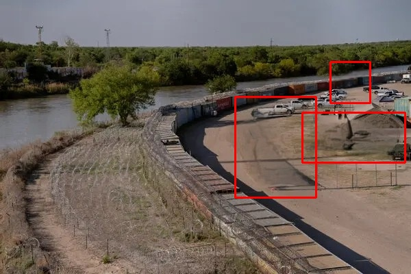

# 🔍 Change Detection Algorithm


A **computer vision–based change detection system** that identifies and localizes meaningful differences between two images of the same scene captured at different times.

Designed and implemented from an **AI / ML engineer’s perspective**, focusing on robustness, clarity, and real-world usability.

---

## 🚀 Features

* Automatic **before–after image pairing**
* Structural change detection using **SSIM**
* Robust to lighting and minor pixel noise
* Detects **small objects** (people, vehicles, missing items)
* Bounding-box visualization of detected changes
* Batch processing support

---

## 📁 Project Structure

```
Change-Detection-Algorithm/
│
├── Change Detection Algorithm images/
│   └── input-images/
│       ├── 1.jpg        # Before image
│       ├── 1~2.jpg      # After image
│       ├── 2.jpg
│       ├── 2~2.jpg
│       └── ...
│
├── output_images/
│   ├── 1.jpg            # Original before
│   ├── 1~3.jpg          # After with detected changes
│   ├── 2.jpg
│   ├── 2~3.jpg
│   └── ...
│
├── main.py
└── README.md
```

---

## 🖼️ Example: Input Images

### Before (`1.jpg`)


### After (`1~2.jpg`)


---

## 🖼️ Example: Output (Detected Changes)

### Result (`1~3.jpg`)



✔ Changed regions automatically detected
✔ Bounding boxes drawn on affected areas
✔ Small and subtle changes preserved

---

## 🧠 How It Works (High Level)

1. Read **before (`X.jpg`)** and **after (`X~2.jpg`)** images
2. Convert images to grayscale
3. Compute **Structural Similarity Index (SSIM)**
4. Generate difference map
5. Apply thresholding + morphological operations
6. Detect contours and draw bounding boxes
7. Save annotated output as **`X~3.jpg`**

---

## 🧪 Technologies Used

* Python
* OpenCV
* NumPy
* SSIM (Structural Similarity Index – `skimage`)

---

## 📌 Use Cases

* Surveillance & security monitoring
* Infrastructure inspection
* Environmental change analysis
* Construction progress tracking
* Remote sensing & satellite imagery

---

## ▶️ How to Run

```bash
python main.py
```

Make sure input images follow this naming pattern:

```
X.jpg     -> Before
X~2.jpg   -> After
```

---

## 🧩 Notes

* Best results when camera viewpoint is fixed
* Minor illumination changes are handled automatically
* Designed for **batch processing**

---

## 👤 Author

**Nagendra Kumar Ojha**
AI / Machine Learning / Computer Vision Engineer

---

⭐ If you like this project, consider giving it a **star** — it helps!

